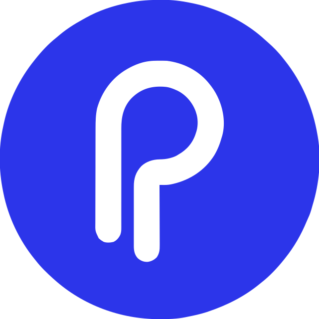

  

A Chrome extension that rewrites prompts on ChatGPT, Claude, and Gemini using on-device AI. Nothing leaves your browser.

### Features

- **Six prompt actions** - Optimize, Few-Shot, Chain of Thought, Assign a Role, Define Output, Add Constraints. Triggered via ⌘⇧K or the selection pill; full shortcut list lives in the toolbar popup (when the model is ready).
- **On-device inference** - Chrome's built-in Gemini Nano. No network calls for prompt content.
- **Streaming output** - tokens render as they generate; insert replaces the host textarea with an 8-second undo.
- **Platform-aware rules** - per-platform optimization rules bundled with the extension; refreshed quarterly via CI and shipped in each release.

### Implementation notes

- Overlay mounts directly to `document.body` and relies on `--pt-*` CSS variable scoping for isolation (Shadow DOM was evaluated and rejected - see `CLAUDE.md`).
- Streaming uses `chrome.runtime.Port` between content script and service worker.
- Text replacement uses a Main World bridge for React compatibility, with an Isolated World fallback.

## Documentation

- **[SETUP.md](docs/SETUP.md):** Environment configuration and startup.
- **[ARCHITECTURE.md](docs/ARCHITECTURE.md):** System design and data flow.
- **[TESTING.md](docs/TESTING.md):** Testing guide.
- **[STYLE.md](docs/STYLE.md):** Dev conventions.
- **[PRIVACY.md](docs/PRIVACY.md):** Privacy policy.

## License

See **[LICENSE](LICENSE)** file for details.
